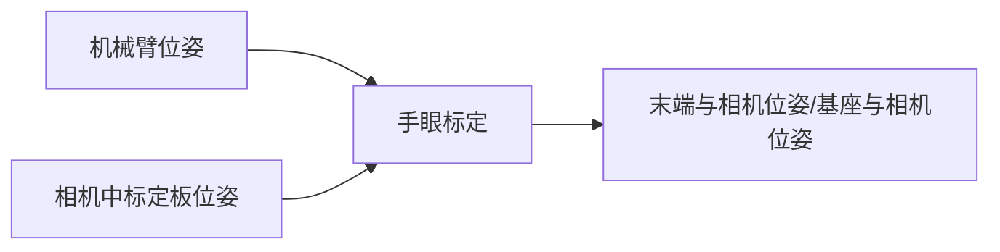

# 基于ROS的手眼标定程序包
## 1.概览
- 如果教程对你有帮助，可以start一下~
- 若需手眼标定小鱼付费-指导请添加微信：`AiIotRobot`
- 本程序支持眼在手上和眼在手外两种标定方式
- 包含基础标定程序包，提供多组机器臂工具坐标和Marker坐标即可完成标定
- 本程序在`ros kinetic melodic noetic`平台测试通过

>本程序包通过输入两组以上的机械臂姿态信息和相机所识别的标志物的姿态信息，经过程序计算可输出，机械臂末端和相机之间（或机械臂基座和相机）的坐标变换矩阵。



## 2.程序下载与编译

### 2.1下载编译

```
git clone https://gitee.com/ohhuo/handeye-calib.git
```

### 2.2编译

```
cd handeye-calib
catkin_make or catkin build
```

## 3.使用指南

按照数据来源分，本程序可分为以下两种使用方式

- 基础标定，从文件读取姿态信息进行计算
- 在线标定，实时从话题读取姿态信息进行计算

### 3.1 基础标定

基础标定是方便大家从机械臂示教器直接读取机械臂的位姿进行标定。

#### 3.1.1 使用前准备

- 准备好多组机械臂位姿数据和相机标定版位姿数据

#### 3.1.2 程序输入与输出

输入

- 机械臂位姿可以通过示教器或者SDK进行获取

- 相机中标定板位姿我们可以通过ArUco或者ArTookit等工具获得，可以参考这里

输出

- （眼在手上）机械臂末端与相机之间的位姿关系

- （眼在手外）机械臂基座与相机之间的位姿态关系

> 位姿描述：我们使用一般读到的`（X,Y,Z,RX,RY,RZ）`六个数据表示，若不理解可以学习下小鱼的动手学机器人学课程。

#### 3.1.3 快读体验（眼在手上为例子）

使用小鱼提供好的数据，可以快速体验手眼标定。

##### 参数配置

找到程序中的`src/handeye-calib/launch/base/base_hand_on_eye_calib.launch`文件，文件中有两个可配置参数

- `base_handeye_data `参数为从位姿文件所在的目录，默认`config/base_hand_on_eye_test_data.csv`
- `base_handeye_result` 参数为结果存储文件目录，默认为`config/result/base_hand_on_eye_result.txt`

```
<launch>
    <!-- 需要输入两个参数 -->
    <arg   name="base_handeye_data"   default="$(find handeye-calib)/config/base_hand_on_eye_test_data.csv" />
    <arg   name="base_handeye_result"   default="$(find handeye-calib)/config/result/base_hand_on_eye_result.txt" />

    <node pkg="handeye-calib" type="base_hand_on_eye_calib.py" name="base_hand_on_eye_calib" output="screen" >
         <param name="base_handeye_data" value="$(arg base_handeye_data)" />
         <param name="base_handeye_result" value="$(arg base_handeye_result)" />
    </node>
</launch>
```

##### 运行程序

```
source devel/setup.bash
roslaunch handeye-calib base_hand_on_eye_calib.launch
```

##### 查看结果

程序会根据配置文件中的坐标进行计算，最终输出如下数据。数据包含不同算法下计算结果，以及计算结果的标准差和方差等数据。

眼在手上最终结果应取：`end_link->marker`之间关系，


## 3.2在线标定

在线标定即实时从话题读取姿态信息进行计算

#### 3.2.1 使用前准备

- 准备好相机驱动（realsense和普通usb相机请参考4.1）
- 已完成相机标定（使用ROS标定程序请参考4.2）
- 安装完成了aruco程序并完成识别（使用aruco识别标定板请参考4.3）

#### 3.2.2 程序输入与输出

输入

- 机械臂位姿，提供给从tf自动获取转成话题（配置好link，可以运行moveit直接运行即可）

- 相机中标定板位姿我们可以通过ArUco工具获得，可以参考这里（使用aruco识别标定板请参考4.3）

输出

- （眼在手上）机械臂末端与相机之间的位姿关系

- （眼在手外）机械臂基座与相机之间的位姿态关系

#### 3.2.3 配置相机与Aruco

配置`src/handeye-calib/launch/aruco/aruco_start_usb_cam.launch`文件

```
    <arg name="camera_info_url"  default="file:///home/ros/.ros/camera_info/head_camera.yaml"/>
    <arg name="video_device"     default="/dev/video0"/>
    <arg name="image_width"      default="640"/>
    <arg name="image_height"     default="480"/>

    <arg name="markerId"        default="0"/>
    <arg name="markerSize"      default="0.107"/>    
    <arg name="eye"             default="left"/>
    <arg name="marker_frame"    default="aruco_marker_frame"/>
    <arg name="ref_frame"       default=""/>  
    <arg name="corner_refinement" default="LINES" /> 
```

主要需修改参数文件如下

- 相机内参畸变文件，完成相机标定你可以得到一个相机内参配置的yaml文件，请将该文件位置作为参数传入
- 设备video地址，默认`/dev/video0`可根据你的个人情况修改
- `markerId`，你打印的id编号，在线打印地址可关注公众号`鱼香ROS`，后台回复`标定板`获取(打印时请选择origin类型)
- `markerSize`，实际打印出来标定版的宽度，单位m

配置完成后即可运行该launch文件

```
source devel/setup.bash
roslaunch handeye-calib aruco_start_usb_cam.launch
```

#### 3.2.4 配置机械臂话题数据

机械臂位置和姿态获取方式可通过两种方式，第一种从tf树中获取，第二种通过对应厂家机械臂的SDK获取。

因第二种方式不具备普适性，小鱼仅适配`jaka`和`aubo`两家机械臂，且目前已不再适配，若需要将本仓库log退至：`7f15641`

##### 修改文件

- 眼在手外修改`src/handeye-calib/launch/online/online_hand_to_eye_calib.launch`

- 眼在手上修改`src/handeye-calib/launch/online/online_hand_on_eye_calib.launch`

眼在手上和眼在手外参数一致，故以眼在手上为例子。

```
	<arg   name="arm_pose_topic"   default="/arm_pose" />
    <arg   name="camera_pose_topic"   default="/aruco_single/pose" />
    
    <arg   name="base_link"   default="/base_link" />
    <arg   name="end_link"   default="/link7" />
```

若使用的是tf方式获取机械臂位置和姿态，仅需要修改以下参数：

- `base_link`,机械臂基坐标系名称
- `end_link`，机械臂末端坐标系名称

若非使用tf方式，直接从话题获取机械臂姿态，请修改

- `arm_pose__topic`, 机械臂位置和姿态所在话题数据，话题类型为：`PoseStamped`

#### 3.2.5 运行在线标定

完成上述修改后即可运行在线标定程序。

```
source devel/setup.bash
roslaunch handeye-calib online_hand_to_eye_calib.launch
```

#### 3.2.6 开始标定
程序运行是会对话题数据进行检测，检测是否收到机械臂数据和标定版位姿数据，如果没有会一直等待。
当检测到已经接收到数据之后，就会出现命令提示，命令定义如下：

```
r  rocord    记录一组手眼数据（当记录的数据大于程序计算所需的数据量之后会进行自动计算）
c  calculate 计算当前数据
s  save      保存数据
p  print     打印当前数据到屏幕上（格式为 type,x,y,z,rx,ry,rz 角度制）
q  quit      退出标定程序
```
```
[INFO] [1635233747.563774]: 手眼标定需要两个位置和姿态，一个是机械臂末端的位姿，将从话题/arm_pose中获取 ,另一个相机中标定版的位置姿态将从话题/aruco_single/pose获取，所以请确保两个话题有数据
[INFO] [1635233748.568178]: 等待机械臂位置和姿态话题到位 ...
[INFO] [1635233749.570482]: 等待机械臂位置和姿态话题到位 ...
指令: r 记录,c 计算,s  保存,q  退出:
```
拖拽机械臂或者用moveit移动机械臂，最终要保证相机中依然可以识别出标定板，输入`r`记录一组手眼数据，记录三组以上即可打印位姿数据。

#### 3.2.7 生成结果
完成标定之后输入`s`即可进行保存，将保存标定结果数据和计算所使用的数据。

##### 眼在手上

如眼在手上可选择`end_link->marker`某一算法输出结果为最终结果

```
algoritihms                     x         y            z        rx        ry       rz    distance
--------------------------  --------  --------  -----------  --------  --------  -------  ----------
end_link->marker：Tsai-Lenz   1.95609   0.592593   0.0368967   -5.43362  16.36     88.8982    2.04422
end_link->marker：Park        1.51555   0.460605   0.0220208   -3.97505  12.2275   89.3891    1.58415
end_link->marker：Horaud      1.51539   0.460554   0.0220166   -3.97621  12.2261   89.3891    1.58399
end_link->marker：Daniilidis  0.699832  0.212166  -0.00299391  -2.42947   7.28523  89.6328    0.731292
```

##### 眼在手外

如眼在手外可选取结果中`base_link->camera`数据的某一算法的平均值作为最终结果

```
Tsai-Lenz                     x             y             z           rx            ry           rz         距离
------------------  -----------  ------------  ------------  -----------  ------------  -----------  -----------
base_link->camera0  1.07708      -0.255704     -0.282747     1.58671      -0.00409023   2.99378      1.14256
base_link->camera1  1.07462      -0.258693     -0.281246     1.59261      -0.0124258    2.99644      1.14054
base_link->camera2  1.07995      -0.254922     -0.2831       1.58326       0.0035099    2.99478      1.14517
mean                1.07722      -0.25644      -0.282364     1.58752      -0.00433537   2.995        1.14276
var                 4.72969e-06   2.64052e-06   6.46241e-07  1.49208e-05   4.23543e-05  1.20167e-06  3.58829e-06
std                 0.00217479    0.00162497    0.000803891  0.00386275    0.00650802   0.00109621   0.00189428
Park                          x             y             z           rx            ry           rz         距离
```


##### 标定结果正确与否的测试
观察数据计算结果的标准差大小。每次计算之后，程序都会输出不同算法下标定结果点的平均数、方差、标准差三项数值。

   > 眼在手上标定结果验证：由于标定过程中标定板是没有发生移动的，所以我们通过机械臂的末端位置、标定结果（手眼矩阵）、标记物在相机中的位姿即可计算出标定板在机器人基坐标系下的位姿，如果标定结果准确该位姿应该是没有变化的。所以可以比较最终数据的波动情况来判定标定结果的好坏。


### 3.3手眼标定结果测试

#### 3.3.1 眼在手外测试

做完手眼标定，我们可以通过测试程序进行手眼标定结果的测试了，小鱼准备好的测试launch文件为`src/handeye-calib/launch/test/test_hand_to_eye_calib.launch`,同样运行测试之前请配置下launch文件。

```
    <arg   name="base_link"   default="/base_link" />
    <arg   name="end_link"   default="/link7_name" />

    <arg   name="base_link2camera_link" default="{'t':[0,0,0],'r':[0,0,0,0]}" />
    <arg   name="camera_link"   default="/camera_frame" />
    <arg   name="marker_link"   default="/aruco_marker_frame"/>
```
一共需要配置的参数有5个

- base_link， 机械臂基座tf名称
- end_link，机械臂末端坐标名称
- base_link2camera_link，机械臂基座和相机之间的位姿关系，手眼标定结果给出，t代表平移单位m，r代表旋转，四元数形式,顺序为qx,qy,qz,qw
- camera_link，aruco中的camera的frame id配置名字，用小鱼的aruco文件无需修改，不清楚请运行aruco识别程序，使用tf查看
- marker_link，aruco中marker的frame_id,同上

配置完成后确保机械臂启动了，aruco识别程序启动了。

使用下面的指令运行

```
source devel/setup.bash
roslaunch handeye-calib test_hand_to_eye_calib.launch
```

程序运行基输出实时的base_link和aruco_marker_frame之间的关系.

```
result:/base_link->/aruco_marker_frame, [0.0, 0.0, 2.0],[0.0, 0.0, 0.0, 1.0]
```

## 4.其他

### 4.1 使用ROS usb_cam驱动相机

#### 4.1.1 安装usbcam

Kinetic：

```
sudo apt-get install ros-kinetic-usb-cam
```

Melodic：

```
sudo apt-get install ros-melodic-usb-cam
```

其他版本

```
sudo apt-get install ros-melodic-版本名称-cam
```

#### 4.1.2 修改launch文件

进入目录：

```
roscd usb_cam
cd launch
sudo gedit usb_cam-test.launch 
```

目前主要修改device和width两个参数，可以使用`ls /dev/video*`查看系统视频设备。

```
<launch>
  <node name="usb_cam" pkg="usb_cam" type="usb_cam_node" output="screen" >
    <!-- modify the video device to your device -->
    <param name="video_device" value="/dev/video2" />
    <!-- modify the size of your device -->
    <param name="image_width" value="1280" />
    <param name="image_height" value="720" />
    <param name="pixel_format" value="yuyv" />
    <param name="camera_frame_id" value="usb_cam" />
    <param name="io_method" value="mmap"/>
  </node>
  <node name="image_view" pkg="image_view" type="image_view" respawn="false" ou$
    <remap from="image" to="/usb_cam/image_raw"/>
    <param name="autosize" value="true" />
  </node>
</launch>
```

#### c. 启动相机

```
roslaunch usb_cam usb_cam-test.launch
```

### 4.2 使用ROS进行相机标定

#### 4.2.1 使用ROS自带的标定程序进行标定。

- 小工具：棋盘格pdf在线生成网站：[点击打开](https://calib.io/pages/camera-calibration-pattern-generator),生成后使用一比一打印要比手动量的要精准哦。
- 标定完成后点击Save可以保存标定所用的图片和参数矩阵。在终端里会输出标定产生的压缩包，默认放在`/tmp`目录下。

#### 4.2.2 运行标定程序

首先运行4.1中的相机程序

```
roslaunch usb_cam usb_cam-test.launch
```

运行前需要根据你的棋盘格修改参数

- 一个是size参数为棋盘格角点数量比如8x9=72个格子的棋盘格，角点个数为7x8=63个，size参数就要写7x8
- 另外一个参数为square，传入的参数为棋盘格一个小格子的宽度（注意单位为m）
- `image`,图像话题的原始数据默认为`camera:=/usb_cam`

```
rosrun camera_calibration cameracalibrator.py --size 10x7 --square 0.015 image:=/usb_cam/image_raw camera:=/usb_cam
```

#### 4.2.3 生成标定文件  

标定完成后点击Calculate会稍微有点卡顿，不要担心后台正在进行标定，完成后下面的SAVE和COMMIT按钮变为可用状态，点击SAVE即可保存标定完成后的文件。

点击commit即可把标定文件存储到系统的`~/.ros/camera_info/xxx.yaml`目录

#### 4.2.4 在ROS中使用该参数

可以在usb_cam的launch文件中增加以下参数，重新启动usb_cam节点，即可使用该标定参数。

参数值小鱼这里写的是`file:///home/dev/.ros/camera_info/ost.yaml`,可打开目录`~/.ros/camera_info/`进行查看

```
<param name="camera_info_url" type="string" value="file:///home/dev/.ros/camera_info/ost.yaml"/>
```

### 4.3 使用系统ArUco获取标定板位姿

#### 4.3.1 安装

  Kinetic：
  ```
  sudo apt-get install ros-kinetic-aruco*
  ```
  Melodic：
  ```
  sudo apt-get install ros-melodic-aruco*
  ```
  其他版本

  ```
  sudo apt-get install ros-版本名称-aruco*
  ```

#### 4.3.2 修改参数

可以直接使用本仓库中handeye-calib所提供的`aruco_start_usb_cam.launch`或者`aruco_start_realsense_sdk.launch` 分别使用realsense和usb相机的驱动来运行，这个视你的相机而定。

需要修改的参数如下：

- camera_info_url 相机标定文件所在位置
- video_device： 设备位置
- image_width： 图片宽度
- image_height： 图片高度
- markerId： 标定板编号，就是你所用的标定板的id，可以通过`在线生成标定板:https://chev.me/arucogen/`进行生成并打印
- markerSize：标定板的宽度 单位m
```

<arg name="camera_info_url"  default="file:///home/dev/.ros/camera_info/ost.yaml"/>
<arg name="video_device"     default="/dev/video2"/>
<arg name="image_width"      default="1280"/>
<arg name="image_height"     default="720"/>

<arg name="markerId"        default="0"/>
<arg name="markerSize"      default="0.151"/>    
```

#### 4.3.3 开始运行

```
source devel/setup.bash
roslaunch handeye-calib aruco_start_usb_cam.launch
```


## 版本日志

- V3.0

  二次修改标定程序

  - 进行了代码整理

  - 增加眼在手外标定
  - 删除jaka,aubo姿态获取程序
  - 增加从tf获取机械臂位置和姿态
  - 修改完善文档

- V2.1
  添加USBCAM，CALIBRATE内容。

- V2.1
  添加Aruco 启动文件。

- V2.0
  添加配合aubo机械臂进行手眼标定程序。

- V1.5
  添加配合jaka机械臂进行手眼标定程序。

- V1.0
  完成基础标定程序包，可以通过文件输出位姿进行，输出标定结果。并进行校验。


## 参考
- easy-handeye
- opencv-calibHandEye
- jaka&&aubo
- aruco_ros
- [csdn](https://blog.csdn.net/sandy_wym_/article/details/83996479)